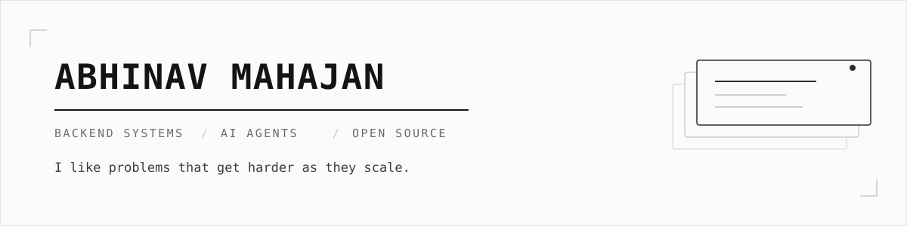

<picture>
  <source media="(prefers-color-scheme: dark)" srcset="assets/banner-dark.svg">
  
</picture>

<br>

Software Engineer at Barclays. I own backend services that run in production, and I spend
most of my free time contributing to open source LLM and agent infrastructure.

The part I care about starts before the code: sitting in design discussions, mapping how
services talk to each other, and finding where a system will break long before it does. The
interesting problem is never making something work once, it's keeping it fast and reliable
when the load stops being polite.

I'd rather understand one system deeply than name drop ten.

<a href="https://www.linkedin.com/in/abhinav-mahajan-b805b022a/">LinkedIn</a> &nbsp;·&nbsp;
<a href="https://abhinav-mahajan.vercel.app">Portfolio</a> &nbsp;·&nbsp;
<a href="mailto:abhinavpm05@gmail.com">Email</a>

<br><br>

### `OPEN SOURCE`

Most of what I know about AI systems came from shipping into other people's codebases and
getting reviewed by engineers who knew the domain better than I did.

<table>
<tr><td width="50%" valign="top">

**[vllm-project/semantic-router](https://github.com/vllm-project/semantic-router)**

`Go` `Rust` `Envoy` `Kubernetes`

Model routing for LLM inference, built under the vLLM org alongside Red Hat,
IBM Research, AMD and Hugging Face.

Member of the Developer Experience and Ecosystem working group, working on routing
internals and contributor tooling.

</td><td width="50%" valign="top">

**[Archestra](https://github.com/archestra-ai/archestra)**

`TypeScript` `MCP` `RAG` `LLM Integrations`

Enterprise MCP security platform. **25+ merged PRs.**

Knowledge connectors for Google Drive, Slack, Salesforce and Linear into the retrieval
pipeline. Org wide admin audit log, agent export and clone, x.AI provider integration,
security hardening for sensitive knowledge sources.

$10M funded, running inside Fortune 50 companies.

</td></tr>
</table>

**[AgentMemory](https://github.com/rohitg00/agentmemory)** &nbsp;`Python`&nbsp; memory layer for AI agents, 20k+ stars. 3 merged PRs.

[**Every merged PR across projects →**](https://github.com/pulls?q=is%3Apr+author%3Aabhinav-m22+is%3Amerged)

<br>

### `WORK`

**Barclays** &nbsp;·&nbsp; Software Engineer &nbsp;·&nbsp; 2025 to present

I own several production backend services end to end, from design review through
deployment and on call. The work that actually takes the time:

**Resilient event driven flows.** Kafka producers and consumers, plus Solace topic
subscriptions, with the retry, failure handling and backpressure that keeps them honest
under real traffic. Most of the design work here is deciding what happens when a downstream
service is slow rather than down.

**Memory and concurrency under load.** Fixed a service that crashed with OOM in production.
It pulled roughly a million rows into memory at once and spawned a virtual thread per entry,
none of which were ever shut down. The fix was bounding both ends: page the reads instead of
loading everything, and gate concurrency instead of creating a thread per row.

**Transaction log friendly deletes.** A raw delete over millions of rows fills the database
transaction log, fails the batch, and can lock the database outright. Rewrote these as
chunked Spring Batch jobs across SQL and MongoDB, so every commit stays small, the log stays
healthy, and a failed run resumes instead of rolling back a week of work.

**Distributed cache coordination.** Kubernetes jobs that refresh in memory caches across
hundreds of pods, keeping state consistent without a stampede.

**Delivery.** GitLab CI/CD for multi module deploys, secrets management, automated
environment provisioning.

<details>
<summary><b>Earlier</b></summary>

<br>

**Ridecell** &nbsp;·&nbsp; Backend Developer Intern &nbsp;·&nbsp; 2025
Refund and payment recovery workflows across 5000+ monthly transactions. Fixed Django and
Braintree integration failures, cutting error rates 35%.

**SellerSetu** &nbsp;·&nbsp; Software Developer Intern &nbsp;·&nbsp; 2024
Django REST and Go services with 75% faster endpoints. PostgreSQL to MongoDB migration for
a 20% query improvement. Load balanced microservice split that cut database strain 30%.

**Barclays** &nbsp;·&nbsp; Technology Summer Intern &nbsp;·&nbsp; 2024
.NET Core status tracking tool and background worker parsing CI logs into JIRA.
Cut standup duration 40%.

</details>

<br>

### `STACK`

```
Production      Java · Spring Boot · Spring Batch · Kafka · Solace
                Kubernetes · MongoDB · PostgreSQL
Also ship in    Go · Python · TypeScript · Django REST · React
Platforms       AWS · GCP · Docker · GitLab CI · Linux
```

<br>

### `ELSEWHERE`

```
Smart India Hackathon 2024     Winner, 1st place, software edition
Motia Backend Hackathon        2nd place, solo, of 4000+
Flipkart GRiD 5.0              Semi-finalist, top 0.5% of 400,000+
ETHIndia / ETHMumbai           Sponsor prizes
```
